# IPO Listing Application

A modern, responsive React application for browsing and exploring Initial Public Offering (IPO) details. Built as part of the Ventura Securities ReactJS assignment.


## 📋 Table of Contents

- [Features](#features)
- [Screenshots](#screenshots)
- [Tech Stack](#tech-stack)
- [Project Structure](#project-structure)
- [Installation](#installation)
- [Usage](#usage)
- [Key Components](#key-components)
- [Design Decisions](#design-decisions)
- [Performance Optimizations](#performance-optimizations)

## ✨ Features

### Core Features
- **IPO List Page**: Browse all available IPOs with comprehensive details
- **IPO Details Page**: View detailed information about specific IPOs
- **Responsive Design**: Fully optimized for desktop, tablet, and mobile devices
- **Search Functionality**: Real-time search with debouncing for better performance
- **Timeline Visualization**: Interactive timeline showing IPO stages (Open, Close, Allotment, Listing)
- **Download Feature**: Export IPO details as text file
- **Apply Modal**: Quick application interface for IPO participation

### UI/UX Features
- Smooth loading skeletons for better perceived performance
- Status-based color coding (Open, Closed, Listed) in mobile view cards
- Breadcrumb navigation for better user orientation
- Expandable "About" section on mobile for content optimization
- Hover effects and smooth transitions
- Error handling with user-friendly messages

## 📸 Screenshots

### Desktop View

**List Page**
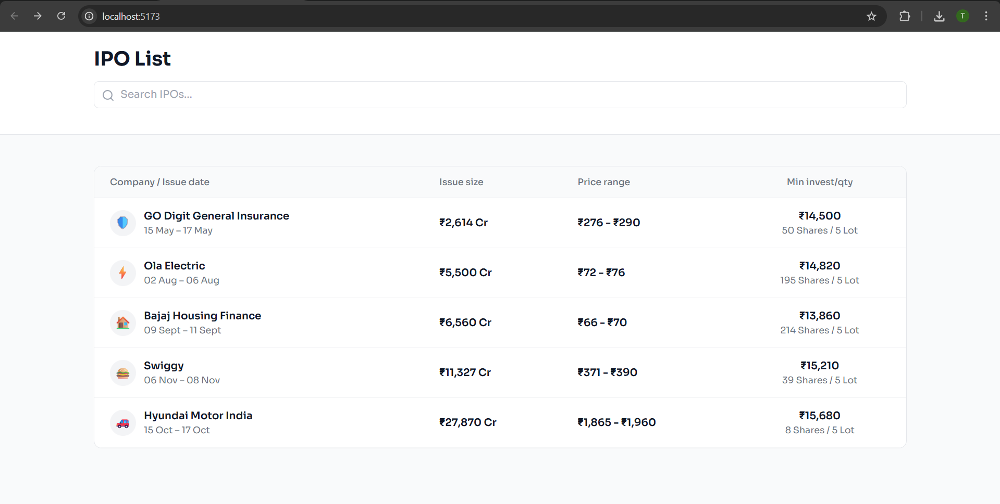
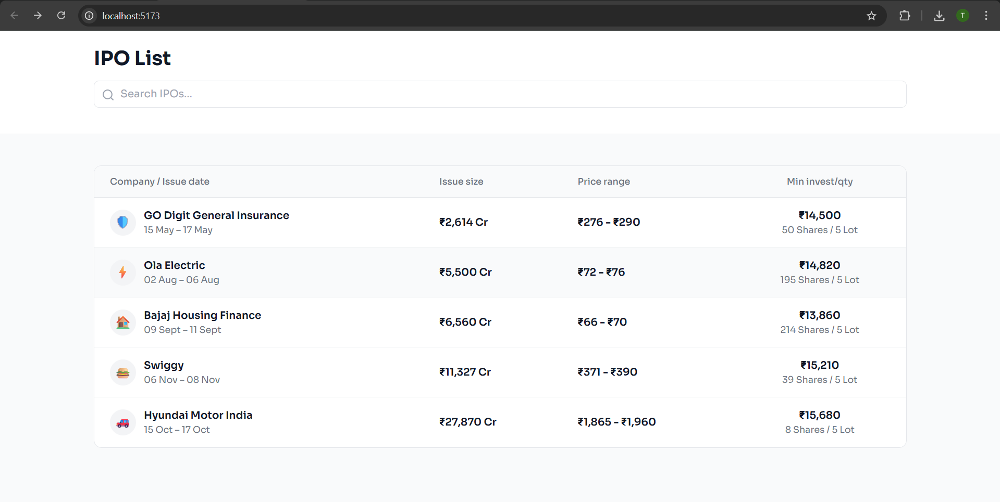
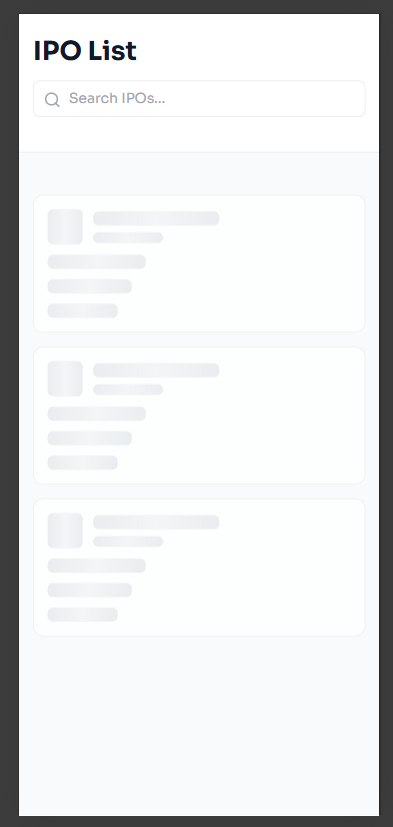
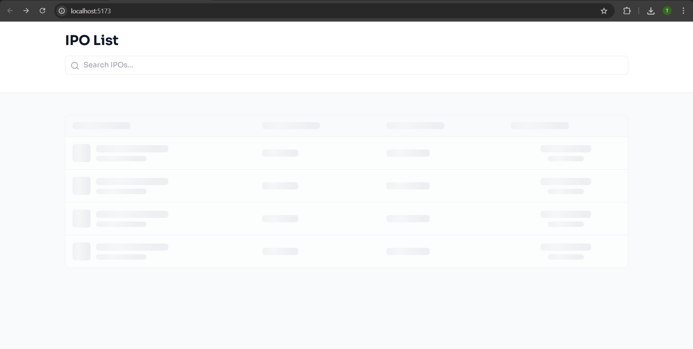
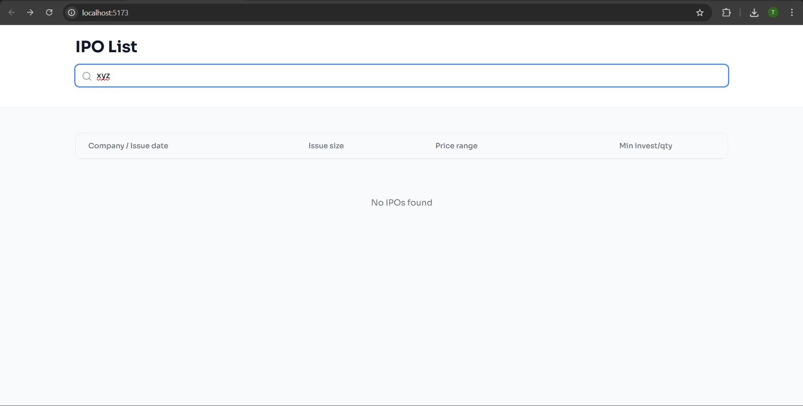
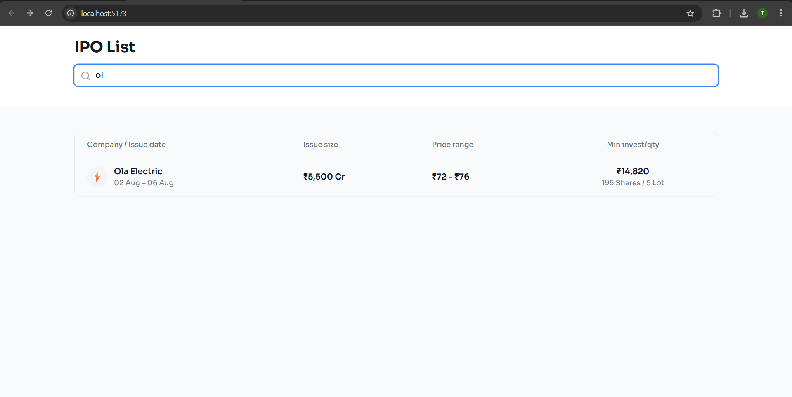
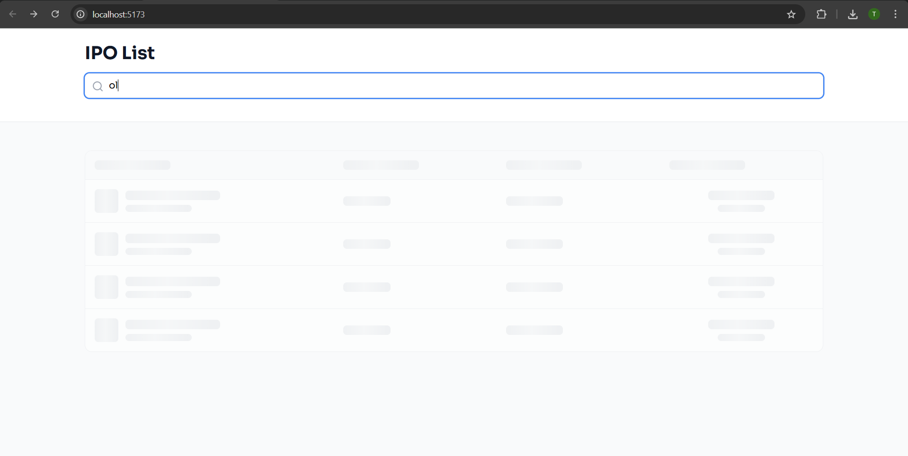

**Details Page**
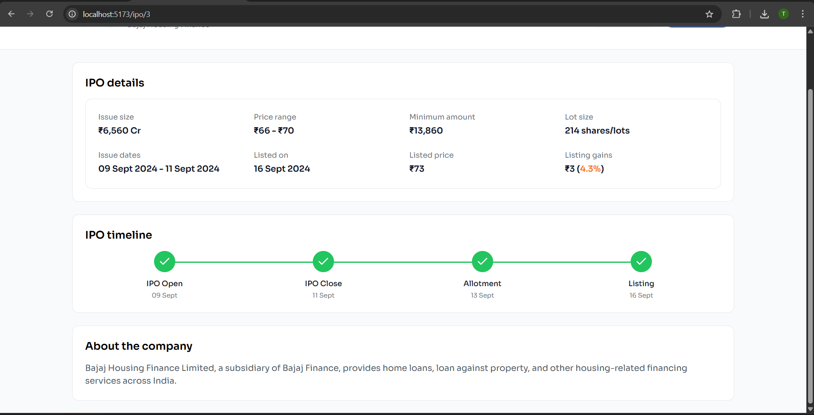
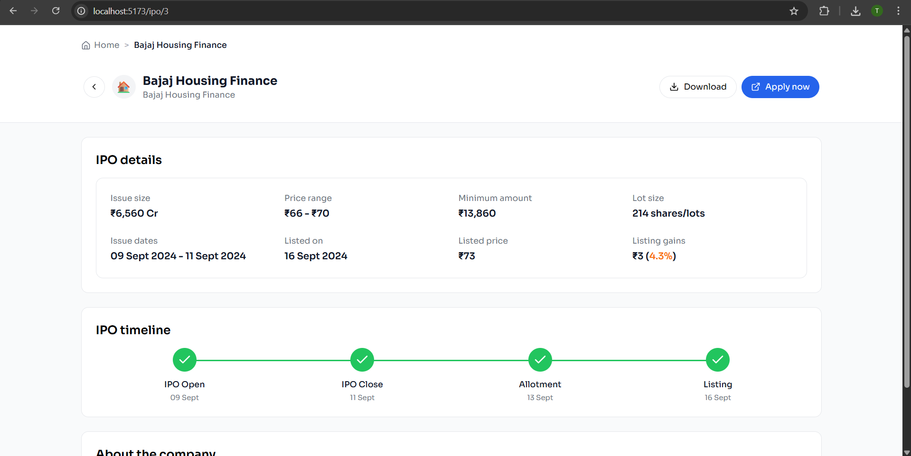
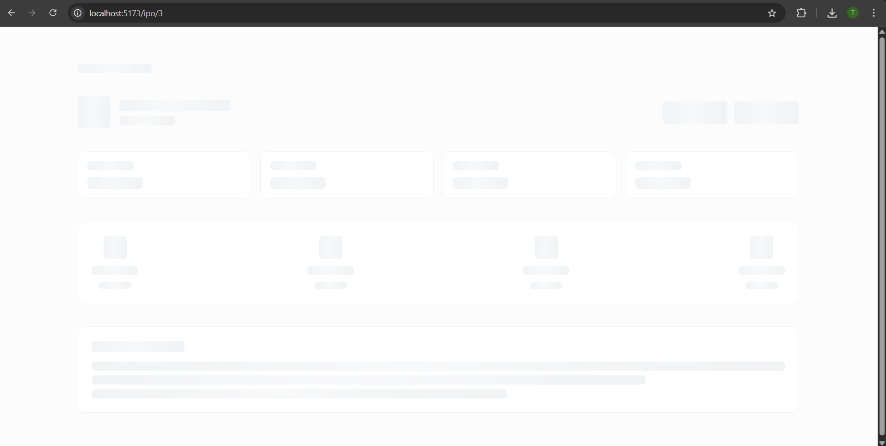

### Mobile View

**List Page**
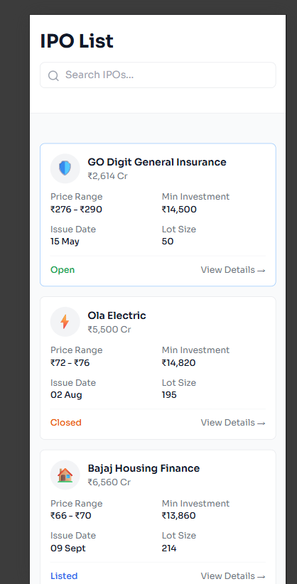
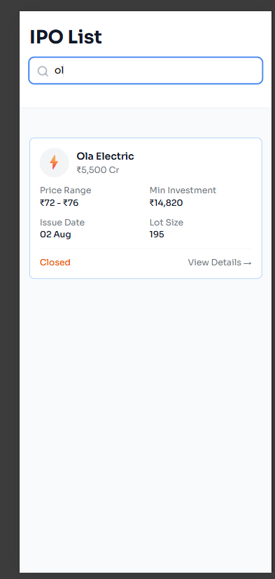
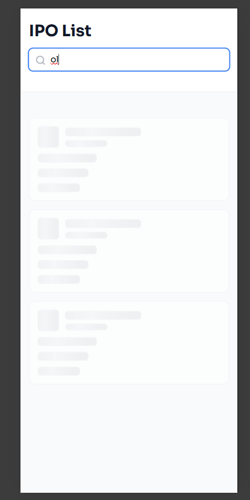

**Details Page**
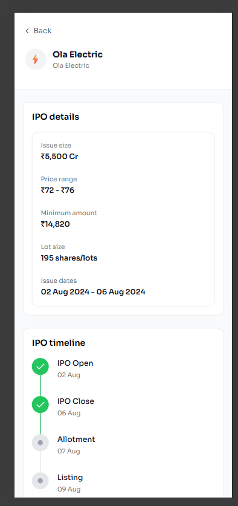


**Read More, Read Less**
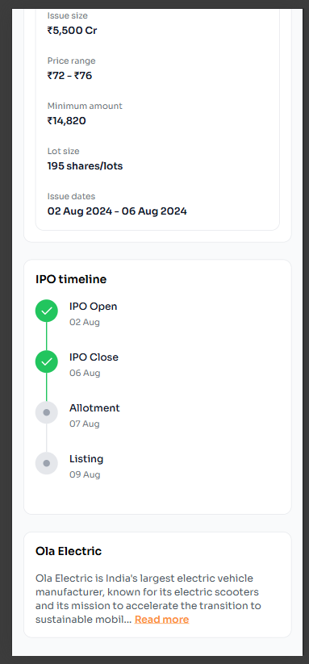


### Desktop View
- **List Page**: Clean table layout with all IPO information
- **Details Page**: Comprehensive company information with horizontal timeline

### Mobile View
- **List Page**: Card-based layout optimized for touch interaction
- **Details Page**: Vertical timeline and stacked information cards

## 🛠 Tech Stack

### Core Technologies
- **React 18.x** - UI library
- **TypeScript** - Type safety and better developer experience
- **Vite** - Fast build tool and dev server
- **React Router DOM** - Client-side routing

### Styling & UI
- **Tailwind CSS** - Utility-first CSS framework
- **Lucide React** - Beautiful, consistent icons
- **Google Fonts (Sora)** - Modern, professional typography

### Development Tools
- **ESLint** - Code linting
- **PostCSS** - CSS processing
- **Autoprefixer** - Browser compatibility

## 📁 Project Structure

```
src/
├── api/                    # API layer
│   ├── fetchClient.ts     # Generic fetch wrapper with delay simulation
│   └── ipoService.ts      # IPO-specific API functions
│
├── assets/                # Static assets
│   └── react.svg
│
├── components/            # Reusable components
│   ├── Breadcrumb/       # Navigation breadcrumb
│   ├── Common/           # Shared components
│   │   └── MobileCard.tsx
│   ├── IPO/              # IPO-specific components
│   │   ├── HorizontalTimeline.tsx
│   │   ├── IPOMobileCard.tsx
│   │   ├── IPOTableRow.tsx
│   │   └── VerticalTimeline.tsx
│   ├── Layout/           # Layout components
│   │   └── Container.tsx
│   ├── Modal/            # Modal dialogs
│   │   └── ApplyModal.tsx
│   ├── Search/           # Search components
│   │   └── SearchBar.tsx
│   ├── Skeleton/         # Loading skeletons
│   │   ├── SkeletonIPODetails.tsx
│   │   ├── SkeletonIPOListDesktop.tsx
│   │   └── SkeletonIPOListMobile.tsx
│   ├── Table/            # Table components
│   │   ├── TableHeader.tsx
│   │   └── TableRow.tsx
│   └── UI/               # Generic UI components
│       └── ErrorBox.tsx
│
├── constants/            # Application constants
│   ├── api.ts           # API endpoints
│   ├── config.ts        # Configuration values
│   ├── labels.ts        # UI labels
│   └── messages.ts      # User messages
│
├── hooks/               # Custom React hooks
│   ├── useDebounce.ts  # Debounce hook for search
│   └── useFetch.ts     # Generic data fetching hook
│
├── pages/               # Page components
│   ├── IPODetailsPage.tsx
│   ├── IPODetailsPageWrapper.tsx
│   └── IPOListPage.tsx
│
├── types/               # TypeScript type definitions
│   └── ipoTypes.ts
│
├── utils/               # Utility functions
│   └── dateUtils.ts
│
├── App.tsx              # Main app component with routing
├── index.css            # Global styles and animations
└── main.tsx             # Application entry point
```

## 🚀 Installation

### Prerequisites
- Node.js (v16 or higher)
- npm or yarn

### Steps

1. **Clone the repository**
```bash
git clone <repository-url>
cd <repository-name>
```

2. **Install dependencies**
```bash
npm install
# or
yarn install
```

3. **Start development server**
```bash
npm run dev
# or
yarn dev
```

4. **Build for production**
```bash
npm run build
# or
yarn build
```

5. **Preview production build**
```bash
npm run preview
# or
yarn preview
```

## 💻 Usage

### Development
The application runs on `http://localhost:5173` by default. The dev server supports hot module replacement for instant updates.

### Data
Sample IPO data is stored in the `public/data/` directory:
- `ipos.json` - List of all IPOs
- `ipo-1.json` to `ipo-5.json` - Individual IPO details

### Routes
- `/` - IPO List Page
- `/ipo/:id` - IPO Details Page

## 🧩 Key Components

### IPOListPage
- Displays all IPOs in a responsive layout
- Implements search with debouncing
- Shows loading skeletons during data fetch
- Handles desktop (table) and mobile (cards) views

### IPODetailsPage
- Shows comprehensive IPO information
- Interactive timeline visualization
- Download functionality for IPO details
- Apply modal for IPO participation
- Responsive breadcrumb navigation

### Custom Hooks

#### `useFetch`
Generic hook for data fetching with loading and error states:
```typescript
const { data, loading, error } = useFetch<IPO[]>(getAllIPOs, []);
```

#### `useDebounce`
Debounces rapidly changing values (like search input):
```typescript
const debouncedSearch = useDebounce(search, 500);
```

## 🎨 Design Decisions

### Typography
- **Font Family**: Sora (as specified in assignment)
- Professional and modern appearance
- Excellent readability across all devices

### Color Scheme
- **Primary**: Blue (#2563EB) for CTAs and active states
- **Success**: Green for completed timeline steps
- **Warning**: Orange for closed IPOs
- **Neutral**: Gray scale for text and backgrounds

### Responsive Strategy
- **Mobile-first approach** with Tailwind's responsive utilities
- **Breakpoints**: 
  - Mobile: < 768px (Cards, Vertical Timeline)
  - Desktop: ≥ 768px (Table, Horizontal Timeline)

### Component Architecture
- **Atomic Design**: Small, reusable components
- **Smart/Dumb pattern**: Container components handle logic, presentational components handle UI
- **Type Safety**: Full TypeScript coverage for better maintainability

## ⚡ Performance Optimizations

### 1. Code Splitting
- React Router for route-based code splitting
- Lazy loading of pages reduces initial bundle size

### 2. Debouncing
- Search input debounced to 500ms
- Reduces unnecessary API calls and re-renders

### 3. Simulated API Delay
- 1.5s delay added to `fetchClient` to demonstrate loading states
- Remove in production for instant data fetching

### 4. Loading Skeletons
- Improves perceived performance
- Better UX than blank screens or spinners

### 5. Optimized Re-renders
- Proper use of React hooks
- Memoization where beneficial
- Efficient state management

## 🎯 Assignment Requirements Checklist

- ✅ IPO List Page with date and lot size information
- ✅ IPO Details Page with web and mobile versions
- ✅ Home navigation placeholder (Breadcrumb)
- ✅ Download button functionality
- ✅ Sora font family implementation
- ✅ Responsive design matching provided mockups
- ✅ Clean, maintainable code structure
- ✅ TypeScript for type safety
- ✅ Modern React best practices

## 🔮 Future Enhancements

- [ ] Backend API integration
- [ ] User authentication
- [ ] Favorites/Watchlist feature
- [ ] Advanced filtering options
- [ ] Real-time price updates
- [ ] Charts and analytics
- [ ] Email notifications
- [ ] Dark mode support

## 📝 Notes

- The application uses simulated API delays to demonstrate loading states
- All data is currently static and stored in JSON files
- In production, connect to actual IPO data APIs
- Environment variables should be used for API endpoints

## 👨‍💻 Developer

Built for Ventura Securities ReactJS Assignment

---

**License**: MIT